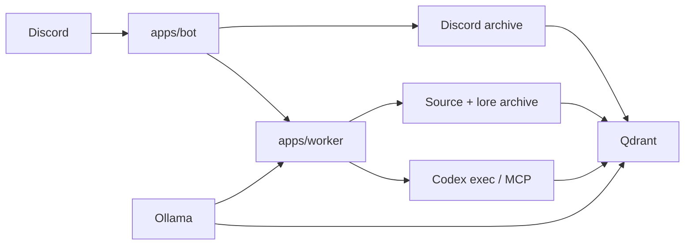

# VoidBot

`TypeScript workspace` · `Discord bot` · `Codex MCP` · `Qdrant` · `Ollama`

VoidBot is a Discord-native assistant for GameCult.

It can answer from archived Discord history, indexed GameCult repos, and Aetheria lore, then hand deeper work off to Codex when Discord stops being a sane place to do it. The current build already supports real Discord replies, semantic retrieval, source and lore indexing, and Codex handoff flows.

## What VoidBot Can Do

- answer owner questions through a Discord-safe `codex exec` lane
- use real MCP tools for archived Discord history, repo search, lore lookup, and owner notifications
- keep an explicit per-speaker interaction memory for direct conversations and ambient mentions of Void
- index live Discord traffic for selected channels
- backfill old Discord exports into the archive
- index source trees and lore repos with local Ollama embeddings
- run semantic retrieval on either local JSON shards or Qdrant
- use a remote Ollama chat model for the `local_llm` provider
- kick off detached source reindex jobs from local Git push hooks

## At A Glance



## Current Shape

The repo is split into a bot, a worker, and a handful of focused packages:

- `apps/bot`: Discord gateway, commands, permissions, and request assembly
- `apps/worker`: background job execution and the Void MCP server
- `packages/core`: queueing, audit log, permissions, style packs, system messages
- `packages/providers`: `owner_codex`, `local_llm`, and provider registry glue
- `packages/rag`: archives, chunking, embedding backends, retrieval, vector stores
- `packages/config`: environment-driven configuration
- `packages/shared`: shared contracts and types
- `packages/sandbox`: policy-first sandbox scaffolding

The durable local state lives under `.voidbot/`. That includes jobs, audit logs, artifacts, archives, interaction memory, and detached indexing logs.

## Quick Start

### 1. Configure `.env`

Copy `.env.example` to `.env`, then set at minimum:

- `DISCORD_BOT_TOKEN`
- `DISCORD_APPLICATION_ID`
- `DISCORD_GUILD_ID`
- `DISCORD_OWNER_ID`

Recommended starting values:

```dotenv
ENABLED_PROVIDERS=owner_codex,local_llm
OWNER_CODEX_MODE=local_exec_owner_only
VECTOR_STORE_KIND=qdrant
RAG_EMBEDDING_BACKEND=ollama
RAG_OLLAMA_MODEL=qwen3-embedding:0.6b
STYLE_PACK_PATH=styles/void-default.md
SYSTEM_MESSAGES_PATH=config/system-messages.json
```

If you want the remote Ollama generation path too, configure:

- `LOCAL_LLM_OLLAMA_BASE_URL`
- `LOCAL_LLM_OLLAMA_MODEL`
- `LOCAL_LLM_OLLAMA_TIMEOUT_MS`
- `LOCAL_LLM_OLLAMA_KEEP_ALIVE`
- `LOCAL_LLM_OLLAMA_THINK`
- `LOCAL_LLM_OLLAMA_NUM_CTX`
- `LOCAL_LLM_ALLOW_PUBLIC`

`LOCAL_LLM_ALLOW_PUBLIC=false` is the sane default. It keeps the local model restricted to admins and the configured owner while you test.

If you want a private local persona instead, point `STYLE_PACK_PATH` and `SYSTEM_MESSAGES_PATH` at your own ignored local files.

### 2. Install dependencies

```bash
npm install
npm run build
```

### 3. Pull the embedding model

VoidBot defaults to Ollama embeddings with `qwen3-embedding:0.6b`:

```bash
ollama pull qwen3-embedding:0.6b
```

`RAG_EMBEDDING_DIMENSIONS` only matters for the hash fallback backend. Ollama-backed embeddings report their own dimensions.

### 4. Start Qdrant

Qdrant is the recommended vector backend now. It avoids the pain that comes from stuffing everything into local JSON and then acting surprised when the file turns into a small moon.

Windows helper path:

```bash
npm run qdrant:setup
```

Normal day-to-day startup after that:

```bash
npm run qdrant:up
```

Or run Qdrant manually:

```powershell
docker pull qdrant/qdrant
docker volume create voidbot_qdrant_storage
docker run -p 6333:6333 -p 6334:6334 -v voidbot_qdrant_storage:/qdrant/storage qdrant/qdrant
```

Then point the bot at it:

```dotenv
VECTOR_STORE_KIND=qdrant
QDRANT_URL=http://127.0.0.1:6333
QDRANT_HISTORY_COLLECTION=voidbot_discord_history_chunks
QDRANT_SOURCE_COLLECTION=voidbot_repository_source_chunks
```

If you already have local vectors and want to lift them into Qdrant without re-embedding:

```bash
npm run rag:migrate-qdrant
```

Use `-- --wipe` only when you intentionally want to replace the target collections.

### 5. Start the stack

The normal startup path is one command:

```bash
npm run stack:start
```

That script:

- verifies Qdrant if `VECTOR_STORE_KIND=qdrant`
- checks the Ollama endpoints and required models
- rebuilds the workspace
- stops stale VoidBot bot/worker processes for this repo
- starts a fresh bot and worker pair
- writes runtime status to `.voidbot/status/runtime-stack.json`
- writes logs to `.voidbot/logs/bot.log` and `.voidbot/logs/worker.log`

If you want the raw split-terminal path for debugging, those still exist:

```bash
npm run dev:bot
```

```bash
npm run dev:worker
```

If `DISCORD_APPLICATION_ID` and `DISCORD_GUILD_ID` are set, the bot registers slash commands into that guild on startup.

For `owner_codex`, the worker also needs a working local Codex CLI. If plain `codex` is not invokable from Node on your machine, point `CODEX_EXECUTABLE` and `CODEX_EXEC_ARGS` at the actual install.

## Example Questions

Things you can ask right now:

- `@Void what did we decide about the website roadmap last year?`
- `@Void summarize prior discussion about ship movement in nautical`
- `/ask provider:local_llm question: where is the MCP server registering search_sources?`
- `/ask provider:local_llm question: what does Aetheria lore say about FTL corporations?`
- `/search-history query: favorite algorithm`

## How The Main Flows Work

### Owner Discord flow

Default mode is `local_exec_owner_only`:

1. The owner uses `@Void ...` or `/ask`.
2. The bot queues an auto-approved owner job.
3. The worker runs `codex exec` in a read-only, Discord-safe lane.
4. Codex can call Void MCP tools such as `search_history`, `get_message_context`, `search_sources`, `get_source_context`, and `list_indexed_repos`.
5. If the answer is short and safe, the worker posts it back to Discord.
6. If the task needs broader tools, file edits, or a deeper investigation, the worker posts a handoff notice and writes a bundle under `.voidbot/artifacts/<job-id>/`.

`/queue-codex` skips the direct-reply attempt and forces the handoff path.

### Manual fallback

`manual_package` still exists when you want the stricter, explicit workflow:

1. Queue a job.
2. Approve it with `/approve-job`.
3. Let the worker write `request.md` and `request.json`.
4. Run the deeper work manually.
5. Approve any final public reply separately.

### Local Ollama flow

The `local_llm` provider uses Ollama chat completion plus a bounded host-managed read-only tool loop. It can use:

- `search_history`
- `get_message_context`
- `search_sources`
- `get_source_context`
- `list_indexed_repos`

Unlike the owner Codex lane, this is not MCP. It is a tighter host-controlled loop and deliberately excludes side-effecting tools.

## Discord, Repo, And Lore Indexing

### Discord history

Discord history is live and incremental:

- matching channels are ingested on `MessageCreate`
- edits are re-upserted
- deletes remove indexed chunks
- `/reindex-channel` replays the most recent 100 messages from the current indexed channel
- exported logs can be backfilled later

Channel selection is controlled by:

- `INDEX_ALL_CHANNELS=true` or `INDEXED_CHANNEL_IDS=...`
- `EXCLUDED_CHANNEL_IDS`
- `EXCLUDED_CHANNEL_NAMES`

Backfill old exports with:

```bash
npm run rag:backfill -- --input /path/to/discord-logs
```

Useful flags:

- `--no-recursive`
- `--all-channels`

### Source repos and lore

Source indexing is incremental when you run it. The pipeline crawls the repo, compares the current documents to the archived source snapshot, deletes vectors for changed or removed source IDs, and upserts only the changed chunks.

Configure:

- `SOURCE_REPO_ROOT`
- `SOURCE_REPO_PATTERNS`
- `SOURCE_REPO_INCLUDE_PREFIXES`
- `RAG_SOURCE_ARCHIVE_PATH`
- `RAG_SOURCE_QUERY_INSTRUCTION`

Index everything that matches your repo patterns:

```bash
npm run rag:index-sources
```

Target specific repos:

```bash
npm run rag:index-sources -- --repo gamecult-site,AetheriaLore
```

Force a clean reindex for specific repos:

```bash
npm run rag:index-sources -- --repo AetheriaLore --force
```

Recommended posture for a shared project root:

- `SOURCE_REPO_PATTERNS=*`
- `SOURCE_REPO_INCLUDE_PREFIXES=AetheriaLore:Aetheria/`

That keeps `AetheriaLore` focused on the useful subtree instead of indexing every random byproduct in the repo.

### Git push hook for source indexing

If you want local pushes to kick off source reindexing automatically:

```bash
npm run rag:install-push-hooks
```

Git does not provide a client-side `post-push` hook, so VoidBot installs a chained `pre-push` hook instead. That hook returns quickly, launches a detached incremental reindex for the pushed repo, and preserves any existing `pre-push` hook by backing it up to `pre-push.voidbot.prev` and running it first.

Progress for those detached runs lives here:

- status: `.voidbot/status/source-hooks/<repo>.json`
- log: `.voidbot/logs/source-hooks/<repo>.log`

That gives you a real polling path instead of an attached session silently rotting while you wonder whether it hung.

## Codex Integration

This repo includes a project-scoped `.codex/config.toml`, so Codex sessions opened in `E:\Projects\VoidBot` can use Void's MCP tools automatically.

If you want the same MCP server available from Codex outside this repo:

```bash
npm run codex:mcp:install
```

Current MCP tools:

- `search_history`
- `get_message_context`
- `search_sources`
- `get_source_context`
- `list_indexed_repos`
- `notify_owner`

Notes:

- read-only retrieval tools work in unattended `codex exec` runs
- side-effecting MCP tool calls still run into approval limits in unattended mode
- the owner Discord lane handles notifications through a host-mediated notification intent instead

To remove the shared Codex registration later:

```bash
npm run codex:mcp:remove
```

## Maintenance

If you change the embedding backend or model, rebuild the vector index from the archived corpora:

```bash
npm run rag:rebuild
```

If you still have an old mixed local JSON vector store from earlier builds, migrate it once before moving on:

```bash
npm run rag:migrate-vector-layout
```

## Commands

Current slash commands:

- `/ask`
- `/queue-codex`
- `/approve-job`
- `/reject-job`
- `/provider-status`
- `/search-history`
- `/summarize-channel`
- `/reindex-channel`
- `/set-style`

Some commands are full working paths. Some are still thin MVPs. They exist because the structure is real, not because the system is pretending to be finished.

## Important Files

Useful local state and docs:

- `.voidbot/jobs/jobs.json`: local job queue
- `.voidbot/audit/events.jsonl`: audit trail
- `.voidbot/artifacts/<job-id>/`: handoff bundles, stdout, stderr, traces
- `.voidbot/rag/messages.json`: archived Discord messages
- `.voidbot/rag/source-documents.json`: archived source and lore documents
- `.voidbot/rag/import-state.json`: log-backfill file state
- `config/system-messages.json`: rotating stock system messages
- `styles/void-default.md`: public default style pack
- `docs/architecture/overview.md`: higher-level architecture notes
- `packages/core/sql/bootstrap.sql`: draft PostgreSQL schema

## Safety Boundaries

- `owner_codex` hard-rejects non-owner traffic
- the Discord-safe owner lane is read-only
- the bot does not expose arbitrary shell execution
- deeper tasks are handed off instead of turning Discord into a cursed remote terminal
- sandbox support is still policy-first and dry-run only
- `manual_package` remains available when you want explicit review points

## Development Roadmap

Reasonable next steps from here:

1. Move queue and audit storage into PostgreSQL.
2. Add health checks, backups, and operational guidance around Qdrant.
3. Expand worker processing into richer provider run records and moderation hooks.
4. Replace the remaining scaffolded provider paths with funded, production-grade implementations.
5. Add real constrained sandbox execution instead of policy-only dry runs.

## Related Docs

- [SPEC.md](./SPEC.md)
- [Architecture Overview](./docs/architecture/overview.md)
- [TypeScript Workspace Decision](./docs/decisions/0001-typescript-workspace.md)
